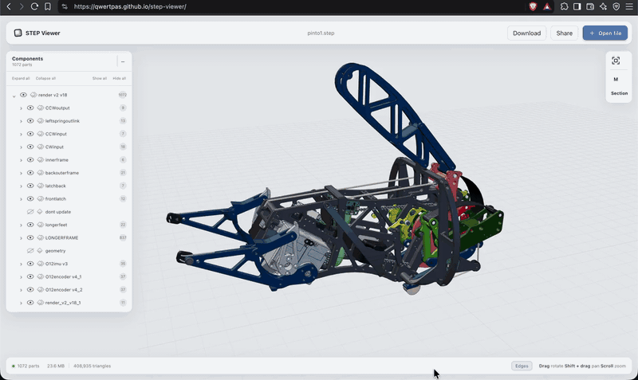

<https://qwertpas.github.io/step-viewer>

Browser-based viewer for drag and drop `.step` and `.stp` CAD files. Great for quickly visualizing CAD files to send or receive from others.

CAD processing is done on your machine, this is a static site with no server.

### Sharing

Sharing works by saving to your own Google Drive. When you click share, Google prompts you for sign-in/consent. The site will create a folder in your Google Drive named "STEP Viewer Shares" and upload the step file there. The site will have access to only that folder, and will enable unlisted sharing (anyone can view if they have the link). Recipients open the viewer link and the CAD loads without needing sign in. Repeated uploads of the same file name will overwrite old files, and the uploader may delete the files from their Google Drive to deprecate the link.

### Tools

- Click on bodies to select them, showing their name and location in the component tree.
- **V** hides or shows selected bodies. Ctrl/Cmd+Z to undo and Ctrl/Cmd+Shift+Z to redo.
- **Measure**: Press **M** or click "M" on the right panel. Select a circular edge or cylindrical face for diameter/radius, a straight edge for length, or a face for area. **Shift-click** another to measure minimum distance.Two supported circular entities also show center distance.
- **Section View**: Click "Section" on the right panel then a planar face. Drag the arrow to move the cut parallel to that face, or enter an offset in millimeters. 

